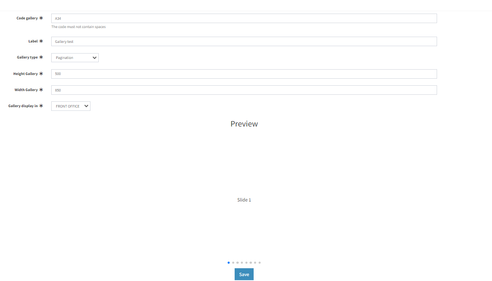
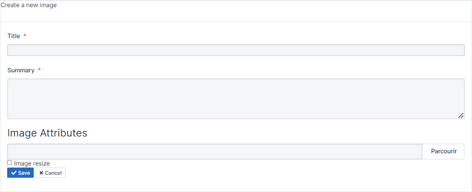
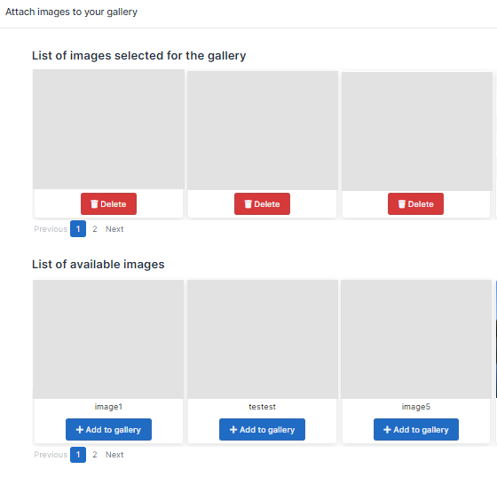

# lutece-tech-plugin-image-gallery
This plugin  involves creating a gallery images where lutece users can manage a variety of images and a slight description. the images can be used in the front and back.

## Create an gallery images in 4 steps

##### 1) Create the gallery images


##### 2) Create image to link with your gallery images


##### 3) Link created images to your gallery images


##### 4) Use the Freemakers Macro below in your Front/Back templates to display the gallery images:
```
<@galleryImage codeGallery=<RAPLACE_BY_CODE_GALLERY> inputName=<OPTIONAL>/>
```
